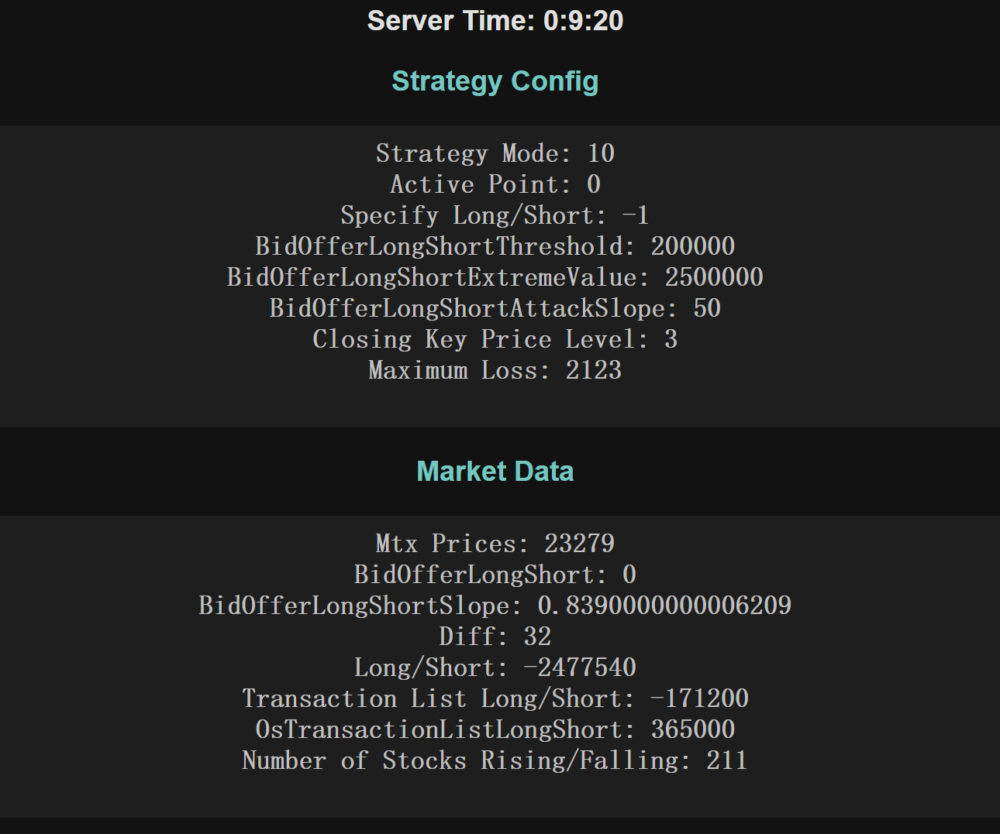
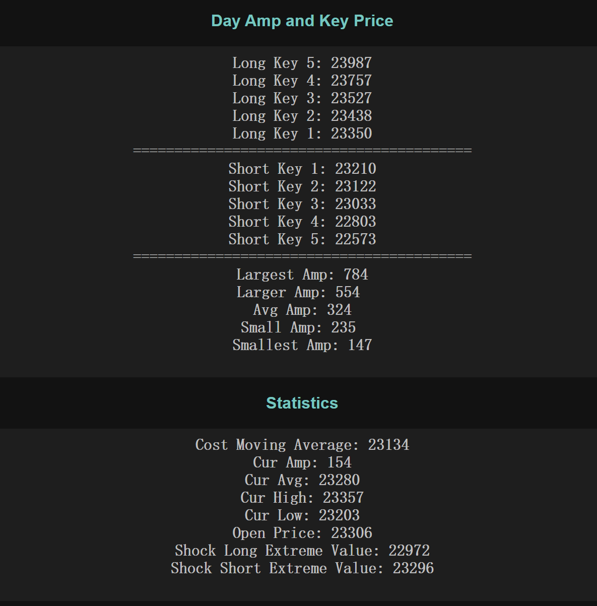
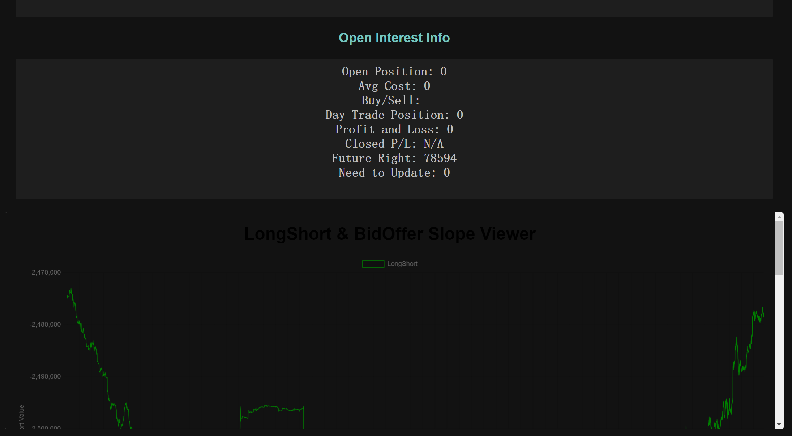
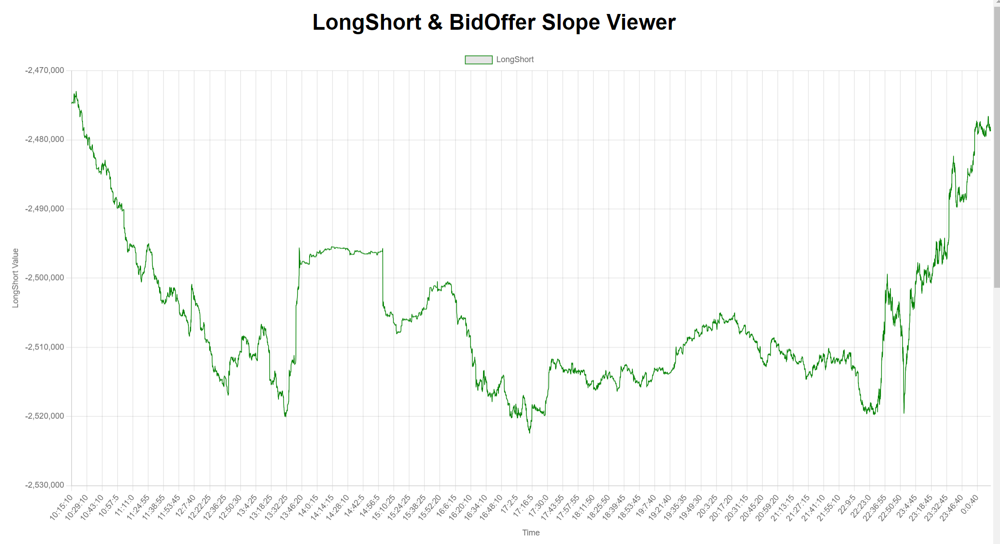
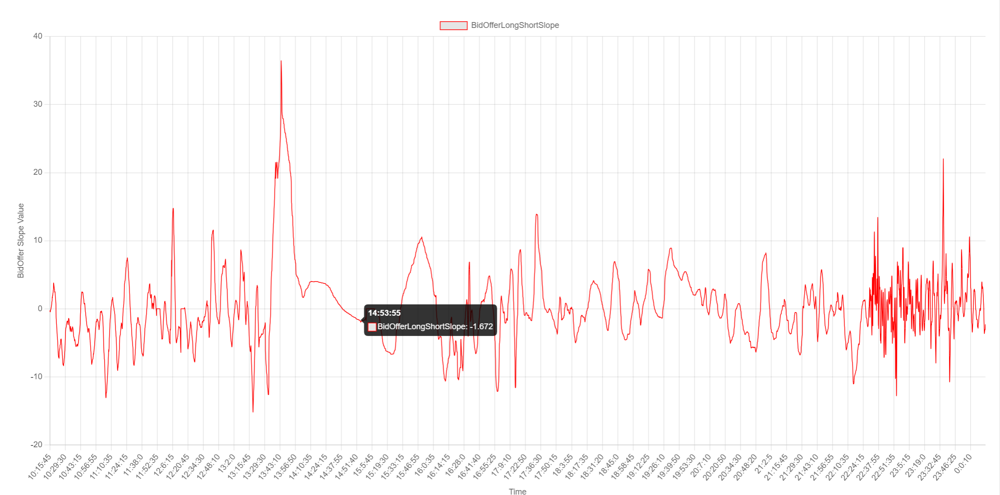
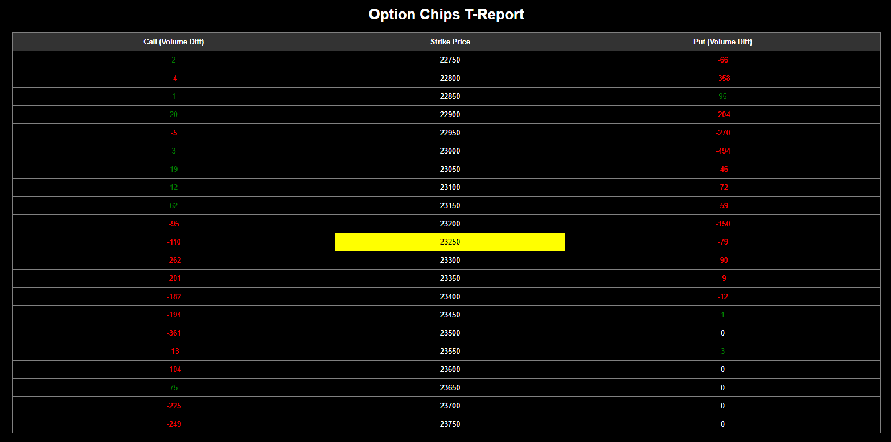

# GengTrader

**GengTrader** is an automated futures trading program designed to execute trading strategies efficiently and accurately. It leverages the Windows COM architecture and integrates with various libraries to process trading data in real-time.

## Features

- **Automated Trading:** Executes trades based on predefined strategies.
- **COM Integration:** Processes real-time market data via COM events.
- **Trading Session Management:** Handles both day and night trading sessions seamlessly.
- **Configurable:** YAML-based configuration for easy customization.

### Prerequisites

1. Windows operating system.
2. Visual Studio (or Visual Studio Code) with C++ support.
3. CMake installed on your system.

## Configuration

The application uses a YAML configuration file to store settings. The configuration includes account details, trading strategies, and session management options.

**GengTrader** - Empowering Futures Trading!

## Screenshots

Here are some screenshots of the **GengTrader** in action:

# User Interface

### Main Interface
  
*Figure 1: Main dashboard overview.*

  
*Figure 2: Detailed view of trading sessions.*

  
*Figure 3: Detailed open position.*

### System Features
- **Real-time Market Data**
  
  
  

